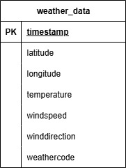
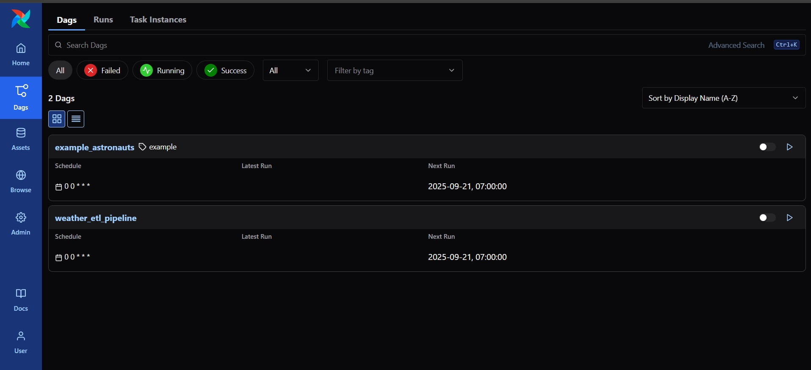
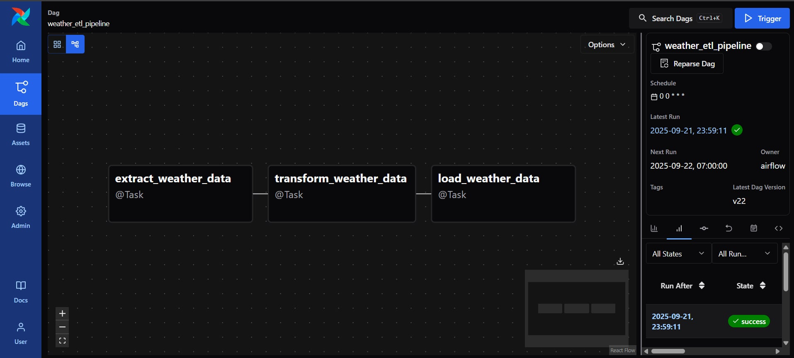
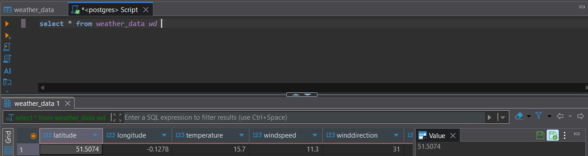

## Table of Contents
- [Overview](#overview)
- [Architecture](#architecture)
- [Dataset Used](#dataset-used)
- [Data Schema](#data-schema)
- [Step in This Project](#step-in-this-project)
- [Results](#results)

# Uber-Data-Analysis

## Overview

Welcome to Astronomer! This project was generated after you ran 'astro dev init' using the Astronomer CLI. This readme describes the contents of the project, as well as how to run Apache Airflow on your local machine.

Astro project contains the following files and folders:

- dags: This folder contains the Python files for your Airflow DAGs. By default, this directory includes one example DAG:
    - `example_astronauts`: This DAG shows a simple ETL pipeline example that queries the list of astronauts currently in space from the Open Notify API and prints a statement for each astronaut. The DAG uses the TaskFlow API to define tasks in Python, and dynamic task mapping to dynamically print a statement for each astronaut. For more on how this DAG works, see our [Getting started tutorial](https://www.astronomer.io/docs/learn/get-started-with-airflow).
- Dockerfile: This file contains a versioned Astro Runtime Docker image that provides a differentiated Airflow experience. If you want to execute other commands or overrides at runtime, specify them here.
- include: This folder contains any additional files that you want to include as part of your project. It is empty by default.
- packages.txt: Install OS-level packages needed for your project by adding them to this file. It is empty by default.
- requirements.txt: Install Python packages needed for your project by adding them to this file. It is empty by default.
- plugins: Add custom or community plugins for your project to this file. It is empty by default.
- airflow_settings.yaml: Use this local-only file to specify Airflow Connections, Variables, and Pools instead of entering them in the Airflow UI as you develop DAGs in this project.

more information - https://www.astronomer.io/
AstroDocumentation - https://www.astronomer.io/docs/astro/deploy-code/

## Architecture

### Tech Stacks
1. Programming Language - Python
2. Docker Container
3. Workflow Orchestrationw - Airflow & Astro
4. Database - PostgreSQL

## Dataset Used
Open-Meteo API
Accurate Weather Forecasts for Any Location
Open-Meteo partners with national weather services to bring you open data with high resolution, ranging from 1 to 11 kilometers. Our powerful APIs intelligently select the most suitable weather models for your specific location, ensuring accurate and reliable forecasts.

With our user-friendly JSON API, accessing weather data has never been easier. Whether you're developing an application or seeking weather information for personal use, our APIs provide seamless integration and deliver the data you need in a simple and accessible format.

Experience the precision and convenience of Open-Meteo's Forecast API, providing comprehensive weather information worldwide. Stay informed and make informed decisions with our reliable weather forecasts.

More Information - https://open-meteo.com/
API Documentation - https://open-meteo.com/en/docs

## Data Schema

## Step in This Project
1. Design Data Schema
2. Set up Astro 
3. Set up Airflow and PostgreSQL
4. Build ETL Pipeline dag

## Results
1. Design Data Schema
2. Build Pipeline dag and sent to aiflow

3. Pipeline 

5. Run Pipeline

6. Query data in PostgreSQL
